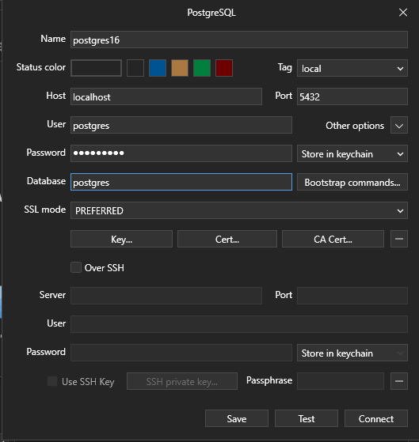

# Rest API : Bank Transactions

## Database CDM/PDM Setup

1. Im using [dbdiagram.io](https://dbdiagram.io)  as a quick and simple tool for creating conceptual database model, design the database as you wish.

2. Convert the ready design to postgresql format.

## PostgreSQL Docker Setup

1. Make sure docker desktop is running, then pull postgre image

```sh
docker pull postgres
```

2. Create and run container with postgres image

```sh
docker run --name postgres16 -p 5432:5432 -e POSTGRES_USER=postgres -e POSTGRES_PASSWORD=insertpw -d postgres:16
```

Alternatively, you can start container with,

```sh
docker run postgres16
```

3. Run docker container, to locate existing container use ``docker ps``

```sh
docker exec -it postgres16 psql -U postgres
```

Based on the image documentation, 

> The PostgreSQL image sets up trust authentication locally so you may notice a password is not required when connecting from localhost

4. To see logs for a container, use

```sh
docker logs postgres16
```

## Managing Database with Tableplus (Optional)

1. Download tableplus from [](https://dbdiagram.io) https://tableplus.com/download

2. Create new postgresql connection,



3. Open and run the ``bank.sql`` from the previous step.